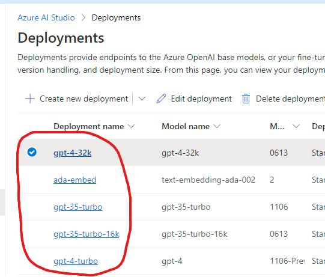

# Doc GPT

|  |
|----------------|

| |

A Visual Studio extension to quickly and easily document your code using LLMs.

## Installation

- Install the extension **free** from [the Visual Studio Marketplace](https://marketplace.visualstudio.com/items?itemName=bc3tech.net-bc3tech-docgpt) or from within Visual Studio's extension manager

## Configuration

- Set up the endpoint for your OpenAI model in the extension's settings
  

### OpenAI.com

You can obtain access to use OpenAI's APIs by [creating a free account]().
> Note: The [free tier of API usage](https://platform.openai.com/docs/guides/rate-limits/usage-tiers) has a limited number of tokens per day which are likely to not meet the needs of this extension. If you start seeing large delays in responses or no responses altogether, you can [upgrade your account](https://openai.com/pricing).

- The endpoint URL for an OpenAI deployment is `https://api.openai.com`
- An API key can be created in your [OpenAI dashboard](https://platform.openai.com/api-keys) - be sure to save it as it will only be shown once!
- To find out which name to put in the model name field, you can use the [OpenAI Playground](https://platform.openai.com/playground?mode=chat) to find the name of the model you want to use:

### Azure OpenAI

Your endpoint URL and key can be found in the details of your OpenAI resource in Azure:

The deployment name is found in your Deployment list in Azure AI Studio:

## Usage

The extension ships with the following components:

1. Analyzer which finds undocumented members
1. Code fix which generates documentation for the member
1. Code refactor which can be used instead of fixer/analyzer; disable the diagnostic, and you can use the refactor as-needed

The analyzer details can be found in the [Shipped](DocGpt.Roslyn/AnalyzerReleases.Shipped.md)/[Unshipped](DocGpt.Roslyn/AnalyzerReleases.Unshipped.md) documentation.

The code fix also reacts to the built-in XML Documentation diagnostic ([CS1591](https://learn.microsoft.com/en-us/dotnet/csharp/language-reference/compiler-messages/cs1591))

> Note: If you'd rather not have the diagnostic fire, you can disable it in your .editorconfig, global suppression file, or inline. Then, you can use the refactor (will only fix a single member at a time) to generate documentation.

 ([demo video](docs/img/demo.mp4))

## Notes

Sending code to GPT can *very* quickly run into token throttling based on endpoint/account configurations. Additionally, please be conscious of the fact that you are charged **per token** sent to the API. Sending large code files to the API can quickly run up a large bill.

Using the code fixer in a "fix all" scenario results in numerous back-to-back calls to the defined endpoint. This can result in request-based throttling. If you encounter this, please try again in a few minutes.

## FAQ

❓ Why would I use this over GitHub CoPilot? \
With the added capabilities of CoPilot, yes, you can use it to document code members. However, it does not offer the Fix All behavior to fully document an entire project or solution.

❓ I don't see the fixer option for a member. Why? \
The code fixer only shows if the options have been configured correctly. Make sure your endpoint URL is a valid full URL and that your API key is present.

❓ It's taking a super long time to generate documentation. Why? \
This will happen if you start to hit your throttling limits as the underlying client will respect the `Retry-After` header on the response and keep trying for a while. If you're using the Azure OpenAI deployment, you can try increasing the number of tokens per request in the Azure portal. Otherwise, you need to wait for your limits to reset.
